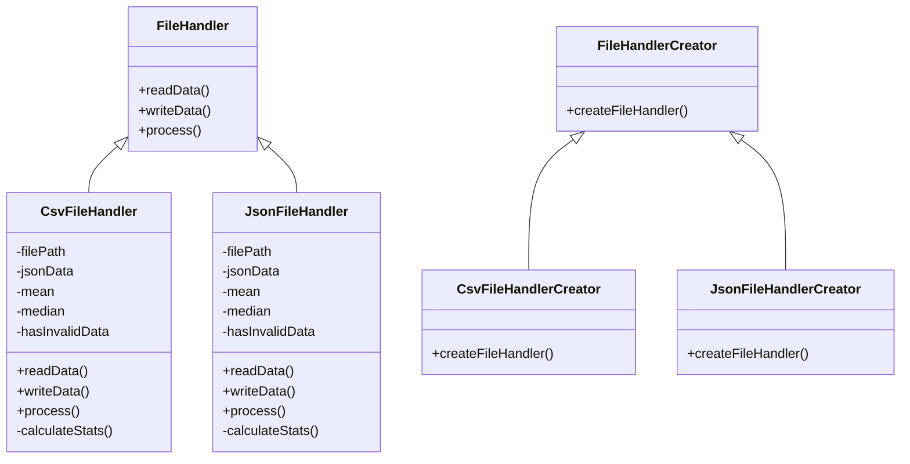

# DataFileProcessor

## Project Overview

The goal of this project is to develop a back-end system capable of interacting with various types of recording files (e.g., JSON, CSV) and potentially other custom file types in the future. The system will be designed with extensibility in mind, allowing for easy integration of new file types as needed. The core functionality includes reading data from a file, performing a computation on the data, and saving the results back into the original file. The project uses C++ for implementation, CMake as the build system, and includes unit tests to ensure code reliability and correctness.

## Requirements

### Functional Requirements
1. **File Interaction**: The system must be able to read and write data to and from JSON and CSV files.
2. **Data Processing**: The system must perform some form of data analysis (e.g., statistical computations) on the file data.
3. **Result Storage**: The results of the data analysis must be saved in a dedicated field within the original file.
4. **Extensibility**: The system should be designed to easily support additional file types in the future.

### Non-Functional Requirements
1. **Platform Compatibility**: The code should be able to compile and run on both Linux and Windows systems.
2. **Build System**: Use CMake to manage the build process.
3. **Testing**: Include unit tests to verify the correctness of the implementation.

## Design

### Class Diagram

## Implementation Logic

### Core Components

1. **FileHandler (Abstract Class)**:
    - This abstract base class defines the interface for file handling operations. It includes pure virtual functions `readData`, `writeData`, and `process` which must be implemented by derived classes. This ensures that all file handlers have a consistent interface.

2. **CsvFileHandler (Derived Class)**:
    - Inherits from `FileHandler` and implements the methods for reading, writing, and processing CSV data. It reads the CSV file into a vector of vectors, performs statistical computations (mean, median, standard deviation), and writes the results back into the CSV file.
    
3. **JsonFileHandler (Derived Class)**:
    - Similar to `CsvFileHandler`, but operates on JSON files. It reads the JSON data into an `nlohmann::json` object, performs the same statistical computations, and writes the results back into the JSON file.

4. **FileHandlerCreator (Abstract Factory Class)**:
    - Defines the interface for creating `FileHandler` objects. This uses the factory design pattern to allow for the creation of file handlers without specifying the exact class of the object that will be created.
    
5. **CsvFileHandlerCreator (Concrete Factory Class)**:
    - Implements the `FileHandlerCreator` interface to create instances of `CsvFileHandler`.

6. **JsonFileHandlerCreator (Concrete Factory Class)**:
    - Implements the `FileHandlerCreator` interface to create instances of `JsonFileHandler`.

### Detailed Workflow

1. **File Reading**:
    - The `readData` method in each file handler class reads the file content into memory. For CSV, it uses a vector of vectors to store the data. For JSON, it uses the `nlohmann::json` library to parse and store the data.

2. **Data Processing**:
    - The `process` method performs statistical analysis on the data. It calculates the mean, median, and standard deviation of the values. If any invalid data is encountered (e.g., non-numeric values in a CSV file), the process is halted and an error message is logged.

3. **File Writing**:
    - The `writeData` method writes the original data along with the computed statistics back into the file. For JSON, the statistics are appended as a new entry. For CSV, the statistics are added as new rows.

4. **Factory Pattern**:
    - The `FileHandlerCreator` factory pattern allows for easy addition of new file types in the future. To add a new file type, you simply create a new file handler class that inherits from `FileHandler`, and a corresponding creator class that inherits from `FileHandlerCreator`.

### `process()` Function Logic

The `process` function is a crucial part of both the `CsvFileHandler` and `JsonFileHandler` classes. It handles the data processing logic. Here’s a detailed explanation of its functionality:

1. **Read Data**: The data is first read from the file and stored in an appropriate data structure (vector of vectors for CSV, `nlohmann::json` object for JSON).
2. **Initialize Storage**: A container is initialized to hold the numerical values extracted from the file.
3. **Extract and Validate Data**: Loop through the stored data to extract numerical values. If any value is invalid (non-numeric for CSV, type mismatch for JSON), an error is logged, and the process is halted.
4. **Calculate Statistics**: If the data is valid, statistical measures such as mean, median, and standard deviation are calculated.
5. **Write Data**: The original data along with the computed statistics are written back into the file.

Here’s an example from the `CsvFileHandler` class:

```cpp
void CsvFileHandler::process() {
    if (csvData.size() <= 1) {
        std::cerr << "CSV data is empty or only contains header row.\n";
        return;
    }

    std::vector<double> values;
    for (size_t i = 1; i < csvData.size(); ++i) { // Skip header row
        if (csvData[i].size() < 2) {
            std::cerr << "Invalid row format in CSV file.\n";
            hasInvalidData = true;
            return;
        }
        try {
            values.push_back(std::stod(csvData[i][1]));
        } catch (const std::invalid_argument& e) {
            std::cerr << "Invalid value in CSV file: " << csvData[i][1] << "\n";
            hasInvalidData = true;
            return;
        }
    }

    if (values.empty()) {
        std::cerr << "No valid data to process.\n";
        return;
    }

    calculateStatistics(values);
}
```
## Extending Support for a New Data File Type
To add support for a new data file type, follow these steps:

1. **Create a New File Handler Class:**

- This class should inherit from the `FileHandler` base class.
- Implement the `readData`, `writeData`, and `process` methods.

Example:

```cpp
#include "FileHandler.hpp"
#include <string>
#include <vector>

class CustomFileHandler : public FileHandler {
public:
    CustomFileHandler(const std::string& filePath);
    void readData() override;
    void writeData() override;
    void process() override;

private:
    std::string filePath;
    // Add appropriate data structures for storing the custom file data
    // Add methods to handle custom data processing and statistics calculation
};

```

2. **Create a New File Handler Creator Class:**

- This class should inherit from `FileHandlerCreator`.
- Implement the `createFileHandler` method to return an instance of the new file handler class.
Example:

```cpp
#include "FileHandlerCreator.hpp"
#include "CustomFileHandler.hpp"

class CustomFileHandlerCreator : public FileHandlerCreator {
public:
    FileHandler* createFileHandler(const std::string& filePath) override {
        return new CustomFileHandler(filePath);
    }
};

```

3. Modify the Main Program to Recognize the New File Type:

- Update the logic in the main function to include a condition for the new file extension.
Example:
```cpp
int main(int argc, char* argv[]) {
    if (argc != 2) {
        std::cerr << "Usage: " << argv[0] << " <file_path>" << std::endl;
        return 1;
    }

    std::string filePath = argv[1];
    std::string extension = getFileExtension(filePath);

    FileHandlerCreator* creator = nullptr;

    if (extension == "json") {
        creator = new JsonFileHandlerCreator();
    } else if (extension == "csv") {
        creator = new CsvFileHandlerCreator();
    } else if (extension == "custom") { // Add condition for new file type
        creator = new CustomFileHandlerCreator();
    } else {
        std::cerr << "Unsupported file type: " << extension << std::endl;
        return 1;
    }

    if (creator) {
        FileHandler* handler = creator->createFileHandler(filePath);
        if (handler) {
            handler->readData();
            handler->process();
            handler->writeData();

            delete handler;
        } else {
            std::cerr << "Failed to create file handler." << std::endl;
        }
        delete creator;
    } else {
        std::cerr << "Unsupported file type." << std::endl;
    }

    return 0;
}
```

## Building and Running the Project

### Building on Linux
1. **Clone the Repository:**
   
```shell
git clone https://github.com/sportokalidis/DataFileProcessor.git
cd DataFileProcessor
```

2. **Create a Build Directory:**
```shell
mkdir build
cd build

```
3. **Run CMake:**
```sh
cmake ..

```
4. **Compile the Project:**
```shell
make
```
5. **Run the Executable:**
```sh
./DataProcessor ../data/randomData.json
```

### Building on Windows

1. **Clone the Repository:**
```shell
git clone https://github.com/sportokalidis/DataFileProcessor.git
cd DataFileProcessor
```

2. **Create a Build Directory:**
```shell
mkdir build
cd build

```
3. **Run CMake:**
```sh
cmake ..

```
4. **Compile the Project:**
```shell
cmake --build .
```
or
- Open the generated .sln file in Visual Studio.
- Build the solution (usually Ctrl+Shift+B).
  
5. **Run the Executable:**
- Navigate to the Debug directory where the executable is generated.
- Run the executable with the required arguments:
```shell
DataProcessor.exe ..\data\TestData.json
```

## Unit Testing
**Test Cases**

1.**Valid JSON and CSV File Processing:**

- Tests that valid JSON and CSV files are read, processed, and written correctly with the calculated statistics included.

2.**Empty File Handling:**

- Tests that empty JSON and CSV files are handled gracefully without crashing.

3.**Invalid Format Handling:**

- Tests that JSON and CSV files with invalid data (e.g., non-numeric values where numbers are expected) are handled properly, with appropriate error messages logged and no statistics calculated.


## Conclusion
This project fulfills the requirements by implementing a system that can read, process, and write JSON and CSV files, with the ability to easily extend support to new file types in the future. The system includes robust error handling and comprehensive unit tests to ensure reliability. The use of the factory design pattern makes the system highly extensible. The project is cross-platform, compiling and running on both Linux and Windows, and uses CMake for build management.


## Plan
1. **Project Structure**

     ```
     DataFileProcessor/
     ├── CMakeLists.txt
     ├── src/
     ├── include/
     ├── data/
     ├── tests/
     ├── docs/
     └── scripts/
     ```
2. **Set up CMake Project**
   - `CMakeLists.txt` file to define the project structure and dependencies.

3. **Base Class for File Handling**
   - Implement an abstract base class with methods for reading, processing, and saving data.

4. **JSON and CSV Handlers**
   - Implement `JsonHandler` and `CsvHandler` classes derived from base class.
   - Use `nlohmann/json.hpp` for JSON parsing and C++ stl for CSV parsing.

5. **Factory Pattern**
   - Data Handeler Factory to return the appropriate handler based on file extension.

6. **Generate sample data files**:
   - Write a script in Python or C++ to generate sample JSON and CSV files.
  
7. **Write tests**:

7. **Write Documentation**:
